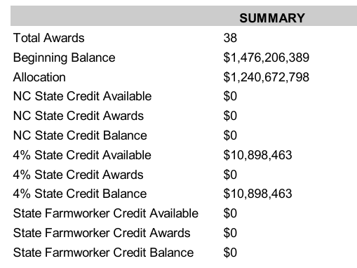
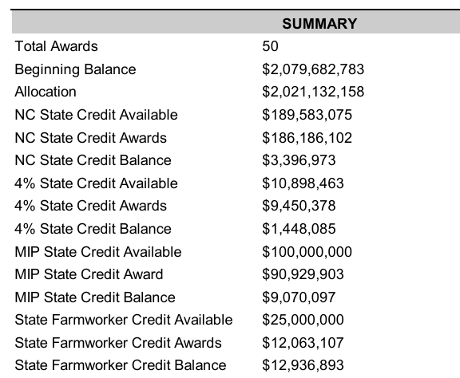

# Affordable Housing

<a target="_blank" href="https://cookiecutter-data-science.drivendata.org/">
    
</a>

Analysing housing projects in California applying for tax-exempt bond financing.  
Objective: to develop a data analysis tool for studying affordable housing projects in California, focusing on tax-exempt bond allocations for Round 1 of 2025. This tool will analyze awarded and rejected projects, visualize key metrics, and predict outcomes for the next funding round, helping us identify trends and guide future applications.

Predictions are hosted on http://aa-affordable-housing-predict-gateway-lambda.s3-website-us-west-1.amazonaws.com/


## Usage
Run Jupyter Notebook to explore the data:
  ```bash
  jupyter-notebook --no-browser notebooks
  ```

## Data Processing
- `affordable_housing/dataset.py`: Merges `award_list.xlsx` and `2025-Applicant-list-4-per-R1.xlsx` from `data/external`, handles NaNs, and saves to `data/processed/merged_dataset.csv`. 

  Run with:
  ```bash
  python affordable_housing/dataset.py
  ``` 
  ```python
  from affordable_housing.dataset import main
  main()
  ```
  ```bash
  make data
  ```

- `affordable_housing/features.py`: Generates ML features from `data/processed/merged_dataset.csv`.  
  - Extracts key numeric and categorical columns, renames them, splits into train/test, applies preprocessing (including one-hot encoding, scaling, and custom transformations), saves processed features to `data/processed/`, and saves the preprocessor model to `models/preprocessor.pkl`.

  Run with:
  ```bash
  python affordable_housing/features.py
  ```

## Training
- `affordable_housing/modeling/train.py`: Trains ML model based on transformed features

## Prediction
- `affordable_housing/modeling/predict.py`: Predict probability of award based on transformed features

## Virtual Environment & Package Management

- This project uses Python *virtualenvwrapper* for environment management.  
  See docs: https://virtualenvwrapper.readthedocs.io/en/latest/command_ref.html#rmvirtualenv
    > Note: Environments created with virtualenvwrapper (via mkvirtualenv) are stored in ~/.virtualenvs/ and can be activated with workon
- Python version: 3.10
### Setup
- Create new environment: `make create_environment` OR `mkvirtualenv (name)`
- Show available environments: `workon` OR `lsvirtualenv`
- Activate environment: `workon affordable_housing`
- Deactivate environment: `deactivate`

### Package Management
- Install all dependencies:
  ```bash
  make requirements
  ```
- For WSL, there might be some path issues with running the affordable_housing module, some methods to solve this: 
  - Dynamic method: 
  ```bash
  pip install -e . 
  python3 affordable_housing/dataset.py
  ```
  in requirements.txt - "-e git+https://github.com/hongjinhao/affordable_housing.git@4a62c854e1a6c55b82bd27edef67cb22cb606615#egg=affordable_housing"
  - Static method: 
  ```bash
  pip install .
  python3 affordable_housing/dataset.py
  ```  
  in requirements.txt - "affordable_housing @ file:///home/dsfee222/affordable_housing"
  - "Run-in-Module-Mode" method:
  ```base
  python3 -m affordable_housing.dataset
  ```

- To view packages installed in the current virtual environment:
  `lssitepackages`

- Key dependencies:
  - pandas, numpy: Data processing
  - scikit-learn: Modeling
  - matplotlib, seaborn: Visualization
  - ruff: Code formatting and linting
  - typer: CLI interface
  - loguru: Logging
  - FastAPI: python web framework 
  - Uvicorn: web server

### Development Workflow
- After installing new packages:
  ```bash
  pip freeze > requirements.txt
  ```
- Format code:
  ```bash
  make format
  ```
- Check code style:
  ```bash
  make lint
  ```
- Clean Python cache files:
  ```bash
  make clean
  ```

### Getting Help
- List all available make commands:
  ```bash
  make help
  ```

 


## Project Organization

```
├── LICENSE            <- Open-source license if one is chosen
├── Makefile           <- Makefile with convenience commands like `make data` or `make train`
├── README.md          <- The top-level README for developers using this project.
├── data
│   ├── external       <- Data from third party sources.
│   ├── interim        <- Intermediate data that has been transformed.
│   ├── processed      <- The final, canonical data sets for modeling.
│   └── raw            <- The original, immutable data dump.
│
├── docs               <- A default mkdocs project; see www.mkdocs.org for details
│
├── models             <- Trained and serialized models, model predictions, or model summaries
│
├── notebooks          <- Jupyter notebooks. Naming convention is a number (for ordering),
│                         the creator's initials, and a short `-` delimited description, e.g.
│                         `1.0-jqp-initial-data-exploration`.
│
├── pyproject.toml     <- Project configuration file with package metadata for 
│                         affordable_housing and configuration for tools like black
│
├── references         <- Data dictionaries, manuals, and all other explanatory materials.
│
├── reports            <- Generated analysis as HTML, PDF, LaTeX, etc.
│   └── figures        <- Generated graphics and figures to be used in reporting
│
├── requirements.txt   <- The requirements file for reproducing the analysis environment, e.g.
│                         generated with `pip freeze > requirements.txt`
│
├── setup.cfg          <- Configuration file for flake8
│
└── affordable_housing   <- Source code for use in this project.
    │
    ├── __init__.py             <- Makes affordable_housing a Python module
    │
    ├── config.py               <- Store useful variables and configuration
    │
    ├── dataset.py              <- Scripts to download or generate data
    │
    ├── features.py             <- Code to create features for modeling
    │
    ├── modeling                
    │   ├── __init__.py 
    │   ├── predict.py          <- Code to run model inference with trained models          
    │   └── train.py            <- Code to train models
    │
    └── plots.py                <- Code to create visualizations
```
## References
- [4% CTCAC data overview](references/jh_grok_applicant_data_overview.pdf): A PDF containing column descriptions and insights for the applicant dataset at `data/external/2025-Applicant-list-4-per-R1.xlsx`


- What is this tax-exempt bond allocation via CDLAC?  
Federal law limits how much tax-exempt debt a state can issue in a calendar year for private projects that have a qualified public benefit. This cap is determined by a population-based formula. The California Debt Limit Allocation Committee (CDLAC) was created to set and allocate California’s annual debt ceiling and administer the State’s tax-exempt bond program to allocate the debt authority. CDLAC’s programs are used to finance affordable housing developments for low-income Californians, build solid waste disposal and waste recycling facilities, and to finance industrial development projects.  
https://www.treasurer.ca.gov/cdlac/

- How is the tax-exempt debt allocated?   
Program Categories: CDLAC allocates bonds to multiple programs (e.g., QRRP, Single-Family Housing, Industrial Development Bonds), with QRRP being the largest category. Within QRRP, subcategories like New Construction, Preservation, Rural, and BIPOC address different housing needs (e.g., new builds vs. rehab, rural vs. urban equity).

- What is QRRP?  
The State of California is short 1.5 million affordable housing units. The Qualified Residential Rental Project Program helps spur affordable housing production by assisting developers of multifamily rental housing units with the acquisition and construction of new units, or the purchase and rehabilitation of existing units.  
https://www.treasurer.ca.gov/cdlac/applications/qrrp/index.asp

- How is this tax-exempt bond allocation related to tax credits and CTCAC?  
 Projects that receive an award of bond authority have the right to apply for non-competitive 4% tax credits, administered by the California Tax Credit Allocation Committee.  
 https://www.treasurer.ca.gov/cdlac/applications/qrrp/index.asp

- Who determines the tax-exempt bond allocation via CDLAC?  
Staff review applications, and the committee votes on the final list

- What does the CTCAC do?  
The California Tax Credit Allocation Committee (CTCAC) administers the **federal and state** Low-Income Housing Tax Credit Programs (LIHTC). Both programs were created to promote private investment in affordable rental housing for low-income Californians.

- What is federal LIHTC?  
The Low-Income Housing Tax Credit (LIHTC) program is the most important resource for creating affordable housing in the United States today. Created by the Tax Reform Act of 1986, the LIHTC program gives State and local LIHTC-allocating agencies the equivalent of approximately $10.5 billion in annual budget authority to issue tax credits for the acquisition, rehabilitation, or new construction of rental housing targeted to lower-income households.  
https://www.huduser.gov/portal/datasets/lihtc.html

- Why are there multiple rounds?  
CDLAC’s tax-exempt bond allocations are organized into multiple rounds (e.g., Round 1, Round 2) within a calendar year, with a competitive, points-based system to distribute a limited annual bond volume cap (e.g., $5.126 billion for 2025).

- Source of the award and applicant list?  
From the CTCAC website  
https://www.treasurer.ca.gov/ctcac/2025/application.asp

- So what does the AWARD column stand for in award_list?   
I am going to assume it means that the housing projects has won the tax-exempt bond allocation (via CDLAC's QRRP program) AND the non-competitive 4% tax credit (via CTCAC's LIHTC program)

- 4% and 9%?  
Seems like CTCAC offers two types of tax credit programs, 4% and 9%. 9% offers a higher amount of tax credits to support development and therefore are typically more competititve. 

- round 2 4% excel has different column names and values from the round 1 4% excel  

|  | round 1 | round 2 | solution |
|--|---------|---------| -------- |
| column: Construction Type | Acq and Rehabilitation | Acquisition/Rehabilitation | rename |
| column: CDLAC Pool | 4 types | 3 types only, missing "rural" | ignore |
| column: New Construction Set Aside | 3 types "none", "homeless, ELI/VLI" and "ELI/VLI" | 3 separate columns for homeless, ELI/VLI and MIP | custom logic | 
| one column names differ | CDLAC TIE-BREAKER SELF SCORE | TIE-BREAKER SELF SCORE | rename |
| column: state credit request | almost none | most projects have this | ? |


- round 2 4% seems to have different allocation categories from round 1 4%



- How does the big beautiful bill affect the tax credits allocation?   
[Impact of Big Beautiful Bill](references/impact_of_big_beautiful_bill.pdf)
Signed into law in early July, therefore would likely affect round 2 of 4% tax credit allocations. Make sense to adjust the model's threshold to account for this positive impact, by reducing threshold for award to 0.44 probability. This increases the number of projects predicted to be awarded by 10%, 59 awarded and 70 rejected total for round 2. (round 1 results was 37 award, 53 rejected)

- Review the data sources   
There are two organisations CDLAC and CTCAC that post data.  
The data from CDLAC reports seem to very closely match that from CTCAC reports, so it seems like almost all projects that win the QRRP also gets the 4% tax credits.  
Thus, I will focus on the reports from CTCAC 4% tax credits since they are already in excel format so no conversion from pdf to excel is required. 
  - [CDLAC 2025 reports](https://www.treasurer.ca.gov/cdlac/py.asp?year=2025)
  - [CDLAC previous years reports](https://www.treasurer.ca.gov/cdlac/prior.asp)
  - [CTCAC 2025 reports](https://www.treasurer.ca.gov/ctcac/2025/application.asp)
  - [CTCAC previous years reports](https://www.treasurer.ca.gov/ctcac/2024/annualreport.asp)

- Data file name format used: 
  - YYYY-RX-ApplicantList.xlsx: applicant data for 4% credits (features)
    - [CDLAC previous years reports](https://www.treasurer.ca.gov/cdlac/prior.asp)
    - [CTCAC 2025 reports](https://www.treasurer.ca.gov/ctcac/2025/application.asp)
  - YYYY-RX-AwardList.xlsx: projects that won 4% credits (labels)
    - [CTCAC 2025 reports](https://www.treasurer.ca.gov/ctcac/2025/application.asp)
  - YYYY-Financing-data.xlsx: projects that won 4% credits (labels)
    - [CTCAC previous years reports](https://www.treasurer.ca.gov/ctcac/2024/annualreport.asp)
  
